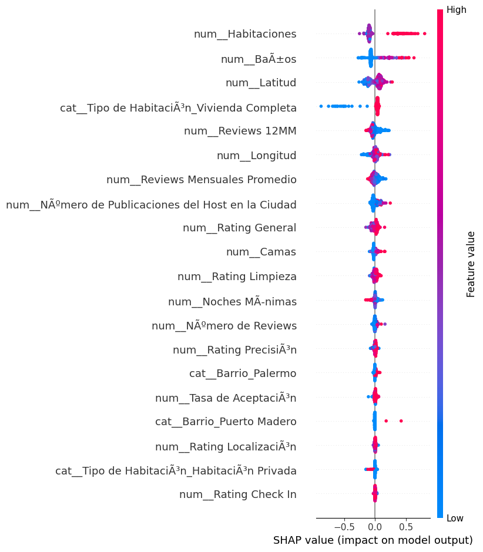

# Airbnb Pricing Intelligence (2025)

An end-to-end Machine Learning project designed to identify and explain the key drivers of Airbnb listing prices using predictive modeling and advanced interpretability techniques.

---

## Executive Summary

This project develops a pricing intelligence model to understand the structural and behavioral determinants of Airbnb prices.

Key findings:

- Property capacity (bedrooms, bathrooms) is the strongest driver of price.
- Host activity and recent review volume significantly impact pricing.
- Geographic coordinates show moderate influence compared to structural features.
- Airbnb pricing is highly non-linear, making tree-based models more suitable than linear regression.

Final Model Performance:
- Linear Regression R²: -2 (failed to capture complexity)
- Random Forest R²: ~0.5
- Evaluation metrics: MAE, RMSE, R²

The project demonstrates the transition from predictive modeling to strategic business insight.

---

## Business Problem

In competitive short-term rental markets, pricing optimization is critical for:

- Revenue maximization
- Competitive positioning
- Strategic property investment decisions
- Host performance benchmarking

The objective was not only to predict prices but to explain what drives them.

---

## Dataset

- Airbnb listings dataset (2025)
- Features include:
  - Property characteristics (bedrooms, bathrooms, room type)
  - Host metrics (number of listings, activity)
  - Review metrics
  - Geographic coordinates
  - Daily price

---

## Methodology

### 1. Data Preparation
- Removed irrelevant identifiers
- Log transformation of price to correct skewness
- Feature engineering
- Handling missing values

### 2. Feature Engineering
- Numerical variables scaled using StandardScaler
- Categorical variables encoded via OneHotEncoding
- Pipeline-based preprocessing

### 3. Modeling Approach
- Baseline Model: Linear Regression
- Final Model: Random Forest Regressor
- Performance evaluated using MAE, RMSE, and R²

### 4. Model Interpretability
- SHAP (SHapley Additive exPlanations)
- Sample-based explanation for computational efficiency
- Directional impact analysis of each feature
## SHAP Summary Plot

---

## Key Insights

### Capacity Drives Price

The number of bedrooms and bathrooms is the dominant pricing factor.

Higher capacity → higher predicted price.

### Host Professionalism Matters

Listings with:
- More recent reviews
- Larger host portfolios

tend to command higher prices.

This suggests operational scale and reputation affect perceived value.

### Location Is Not the Sole Driver

Latitude and longitude showed moderate impact compared to structural features, indicating that within this dataset, property characteristics outweigh micro-location differences.

---

## Technical Stack

- Python
- Pandas
- NumPy
- Scikit-learn
- SHAP
- Matplotlib / Seaborn

---

## Project Structure
Airbnb-Pricing-ML/
│
├── airbnb_pricing_analysis.ipynb
├── data/
│ └── airbnb_2025.csv
├── images/
│ ├── shap_summary.png
│ └── feature_importance.png
└── README.md

---

## What This Project Demonstrates

- End-to-end ML workflow
- Model comparison and evaluation
- Handling non-linear relationships
- Advanced model interpretability
- Translation of technical results into business insights

This project reflects the ability to combine analytical rigor with strategic thinking.

---

## About Me

Aspiring Data Analyst / Data Scientist focused on:

- Machine Learning
- Business Intelligence
- Data-driven strategy
- Customer behavior analytics

Passionate about turning complex data into actionable insights.

